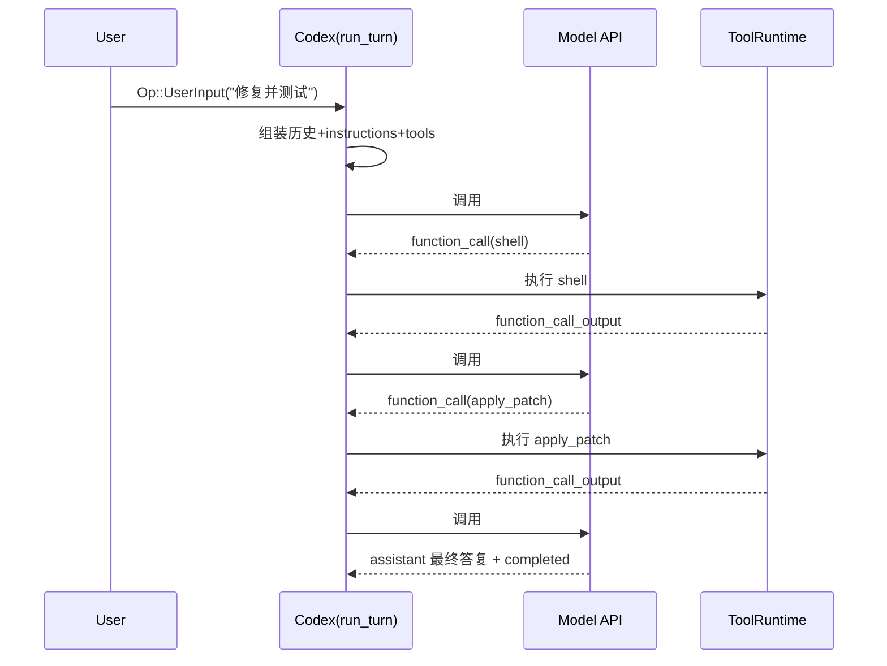

# Codex 请求处理内部流程（运行时视角）

本文基于 `codex-rs/core` 的实际执行链路，描述一次用户请求如何被组装、发送到 Responses API、执行工具并触发后续多轮模型调用。

## 1. 完整请求组成

一次实际的模型请求由以下内容构成：

- `model`：本轮模型名（来自 turn context）
- `instructions`：base instructions（不是 user message，而是 Responses API 顶层字段）
- `input`：历史消息列表（包含开发者策略、AGENTS/用户说明、环境上下文、用户消息、工具调用与工具输出）
- `tools`：可调用工具 schema（本地工具 + MCP 工具 + 动态工具过滤结果）
- `parallel_tool_calls`：是否允许并行工具调用
- `reasoning`：推理配置（effort/summary）
- `tool_choice`：通常为 `auto`
- `store`、`stream`、`include`、`prompt_cache_key`、`text`

这些字段最终构造成 `ResponsesApiRequest`。

## 2. 组装规则与来源

### 2.1 来源优先级（会话级）

- base instructions 优先级：
  1) `config.base_instructions`
  2) 已有历史会话里记录的 base instructions
  3) 模型默认 instructions
- `user_instructions` 会由 `config.user_instructions` + 项目路径链路上的 `AGENTS.md` + 可选技能/JS REPL/子 agent 说明拼装。

### 2.2 首次 turn 的自动注入

首次历史会注入：

- 基于审批策略 + 沙箱策略生成的 developer instructions（含 `<permissions instructions>`）
- 可选 developer_instructions / collaboration mode 指令 / personality 指令
- 用户说明（AGENTS 指令）
- 环境上下文（`<environment_context>`，含 cwd/shell/网络）

这些都作为 `input` 里的 `ResponseItem::Message` 发送。

### 2.3 后续请求复用与调整

在每一轮采样前：

1) 把 pending input 合并到历史。
2) 从 history 生成新的 `sampling_request_input`。
3) 根据当前模型与配置重算 tools（可变）。
4) 若 token 接近上限且仍需 follow-up，触发 compact 后继续下一轮。

## 3. 多次模型调用如何触发

在单个用户 turn 内，多次调用常见触发条件：

- 模型返回 tool call（必须执行工具，再把工具输出回灌给模型）
- 请求流错误导致 retry / 传输降级（WS -> HTTPS）
- 运行中用户追加输入
- auto-compact 后继续采样

因此同一 turn 常见是：

- 调用 #1：模型先规划并发工具调用
- 调用 #2：读取工具结果后继续决定下一步
- 调用 #3：给最终自然语言输出

## 3.1 后续 prompt 如何“携带前序上下文”（更具体）

这一点在运行时是通过 **history 重建**完成的：每一轮不会只发送“新增一句话”，而是从会话历史中重新生成 `sampling_request_input`。

### A) 携带位置

- 顶层字段：`ResponsesApiRequest.input`
- 数据类型：`Vec<ResponseItem>`
- 编码形式：结构化 item（`message` / `function_call` / `function_call_output` 等），不是一整段拼接字符串。

### B) 每轮如何形成“下一轮输入”

1. 本轮收到模型流事件（`OutputItemDone`）。
2. 若是工具调用，先把该 `function_call` 记入历史，再异步执行工具。
3. 工具返回后把 `function_call_output` 也记入历史。
4. 下一轮开始前，从 history 重新导出完整 `sampling_request_input`，它天然包含：
   - 首轮注入项（permissions / AGENTS / environment）
   - 用户原始消息
   - 上一轮模型产出的 `function_call`
   - 上一轮工具产出的 `function_call_output`

### C) 具体“携带形式”示例

#### 第 1 次模型调用（Call #1）

```jsonc
{
  "input": [
    {"type":"message","role":"developer","content":[{"type":"input_text","text":"<permissions instructions>..."}]},
    {"type":"message","role":"user","content":[{"type":"input_text","text":"# AGENTS.md instructions for /workspace/codex ..."}]},
    {"type":"message","role":"user","content":[{"type":"input_text","text":"<environment_context>..."}]},
    {"type":"message","role":"user","content":[{"type":"input_text","text":"请修复测试并运行"}]}
  ]
}
```

#### 第 2 次模型调用（Call #2）

与 Call #1 相比，`input` **尾部新增**两类 item：

```jsonc
{
  "input": [
    "...Call #1 的全部输入项...",
    {
      "type":"function_call",
      "name":"shell",
      "arguments":"{\"command\":\"cargo test -p codex-core\"}",
      "call_id":"call_001"
    },
    {
      "type":"function_call_output",
      "call_id":"call_001",
      "output":"Exit code: 101\nWall time: 3.2 seconds\nOutput: test_x failed ..."
    }
  ]
}
```

#### 第 3 次模型调用（Call #3）

若 Call #2 又触发 `apply_patch`，那么 Call #3 的 `input` 尾部会再新增：

```jsonc
{
  "input": [
    "...Call #2 的全部输入项...",
    {
      "type":"function_call",
      "name":"apply_patch",
      "arguments":"*** Begin Patch ...",
      "call_id":"call_002"
    },
    {
      "type":"function_call_output",
      "call_id":"call_002",
      "output":"Exit code: 0\nWall time: 0.1 seconds\nOutput: Success. Updated files: ..."
    }
  ]
}
```

> 重点：调用间的衔接并非靠“前一轮 assistant 纯文本复制”，而是靠结构化 `ResponseItem` 追加到同一条历史，再在下一轮整体重放进 `input`。

### D) 哪些字段通常保持不变，哪些会变化

- 常保持稳定：
  - `instructions`（同一 turn 一般不变）
  - `tool_choice`（通常 `auto`）
  - `stream`（通常 `true`）
  - `prompt_cache_key`（同一会话 thread id）
- 常发生变化：
  - `input`（每轮追加新 item）
  - `tools`（如果工具可见性/选择器变化，会重算）
  - `reasoning/include/text`（取决于模型能力或配置变化）

### E) compact 对后续 prompt 的影响

当 token 接近阈值且仍需 follow-up 时，会触发 compact。compact 后下一轮 `input` 不再是完整原始长历史，而是“压缩摘要 + 后续关键项（新工具调用/输出/用户增量）”的组合，以降低上下文占用。

这也是为什么你会看到“逻辑连续”，但后续请求体中的历史形态已经从全量明细切换为摘要化表示。

## 4. 典型请求体（伪 JSON）

```json
{
  "model": "codex-mini-latest",
  "instructions": "<base instructions...>",
  "input": [
    {
      "type": "message",
      "role": "developer",
      "content": [
        { "type": "input_text", "text": "<permissions instructions>..." }
      ]
    },
    {
      "type": "message",
      "role": "user",
      "content": [
        {
          "type": "input_text",
          "text": "# AGENTS.md instructions for /workspace/codex\\n\\n<INSTRUCTIONS>..."
        }
      ]
    },
    {
      "type": "message",
      "role": "user",
      "content": [
        {
          "type": "input_text",
          "text": "<environment_context>\\n  <cwd>/workspace/codex</cwd>..."
        }
      ]
    },
    {
      "type": "message",
      "role": "user",
      "content": [
        { "type": "input_text", "text": "请修复测试并运行" }
      ]
    },
    {
      "type": "function_call_output",
      "call_id": "call_123",
      "output": "Exit code: 0\\nWall time: 0.2 seconds\\nOutput: ..."
    }
  ],
  "tools": [
    { "type": "function", "name": "shell", "description": "...", "parameters": {} },
    { "type": "function", "name": "apply_patch", "description": "...", "parameters": {} }
  ],
  "tool_choice": "auto",
  "parallel_tool_calls": true,
  "reasoning": { "effort": "medium", "summary": "auto" },
  "store": false,
  "stream": true,
  "include": ["reasoning.encrypted_content"],
  "prompt_cache_key": "thread-uuid",
  "text": {
    "verbosity": "medium",
    "format": {
      "type": "json_schema",
      "strict": true,
      "name": "codex_output_schema",
      "schema": {"type": "object"}
    }
  }
}
```

## 5. 调用时序（示例）


