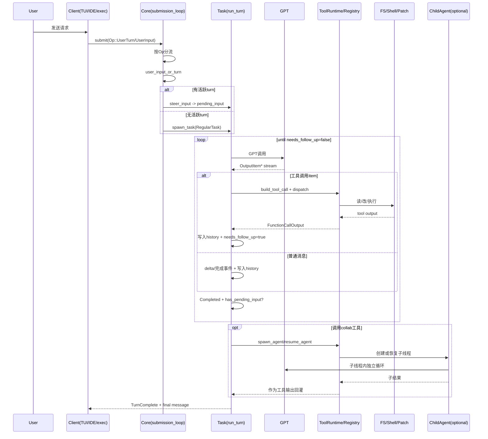

# Codex 一次请求的实际运行流程（调用级视角）

目标：按真实执行顺序说明，一次用户请求在 `codex-rs` 内部如何被处理、何时多次调用 GPT、何时触发工具、何时拆分子任务。

---

## 1. 按真实顺序的主流程（一次普通请求）

### 1.1 请求进入：先变成 `Op`

前端（TUI/IDE/exec）不会直接调用模型，而是先提交一个操作信封 `Op`。  
`Op` 定义：`codex-rs/protocol/src/protocol.rs:90`

对于普通对话通常是：

1. `Op::UserInput`
2. `Op::UserTurn`

随后进入核心分发循环：

- `submission_loop`：`codex-rs/core/src/codex.rs:2924`

它按 `Op` 分支，不做“自然语言意图分类器”。

### 1.2 分发到用户输入处理器

`Op::UserInput`/`Op::UserTurn` 会进入：

- `handlers::user_input_or_turn`：`codex-rs/core/src/codex.rs:3152`

该函数先创建本轮上下文（`TurnContext`），再尝试把输入注入当前活动任务：

- `steer_input`：`codex-rs/core/src/codex.rs:2661`

分两种情况：

1. 有活动 turn：输入进入 `TurnState.pending_input`，不新开任务（`codex-rs/core/src/state/turn.rs:71`）。
2. 无活动 turn：`spawn_task(..., RegularTask)` 新开常规任务（`codex-rs/core/src/codex.rs:3231`）。

### 1.3 启动任务：`spawn_task`

任务启动器：

- `codex-rs/core/src/tasks/mod.rs:116`

关键行为：

1. 先中断旧任务：`abort_all_tasks(TurnAbortReason::Replaced)`（`tasks/mod.rs:122`）。
2. 注册 `ActiveTurn`。
3. 启动 `RegularTask::run`（`codex-rs/core/src/tasks/regular.rs:89`）。

### 1.4 进入本轮执行：`run_turn`

主循环：

- `run_turn`：`codex-rs/core/src/codex.rs:3956`

它会先记录用户消息、拼接历史、处理技能注入，再开始采样循环。

### 1.5 每次模型调用前如何构造输入

每轮调用都会构造 `Prompt`：

- `Prompt` 结构：`codex-rs/core/src/client_common.rs:27`
- 构造位置：`codex-rs/core/src/codex.rs:4413`

首次模型调用输入构成（后续轮次同构但内容增量变化）：

1. `input`：会话历史 + 当前用户输入 + 历次工具输出（来源于 `ContextManager`）。
2. `tools`：本轮可用工具集合（`built_tools` + `ToolRouter`）。
3. `parallel_tool_calls`：模型是否支持并行工具调用。
4. `base_instructions`：会话基础指令。
5. `personality`、`output_schema`：本轮约束参数。

工具集合构建入口：

- `built_tools`：`codex-rs/core/src/codex.rs:4512`
- `ToolsConfig::new`：`codex-rs/core/src/tools/spec.rs:50`
- `build_specs`：`codex-rs/core/src/tools/spec.rs:1379`

### 1.6 模型流输出如何驱动动作

流处理主循环：

- `try_run_sampling_request`：`codex-rs/core/src/codex.rs:4983`

关键事件：

1. `OutputItemAdded`：发 UI item started。
2. `OutputTextDelta`：流式文本增量。
3. `OutputItemDone`：判定是否工具调用。
4. `Completed`：更新 token 使用并决定是否继续下一轮。

工具判定入口：

- `handle_output_item_done`：`codex-rs/core/src/stream_events_utils.rs:46`
- `ToolRouter::build_tool_call`：`codex-rs/core/src/tools/router.rs:63`

只有这些会被视为“要执行工具”：

1. `ResponseItem::FunctionCall`
2. `ResponseItem::CustomToolCall`
3. `ResponseItem::LocalShellCall`

执行链路：

1. `ToolCallRuntime::handle_tool_call`：`codex-rs/core/src/tools/parallel.rs:50`
2. `ToolRegistry::dispatch`：`codex-rs/core/src/tools/registry.rs:76`
3. 具体 handler 执行读文件/改代码/命令

---

## 2. 何时会发生多次 GPT 调用

同一个用户请求在一个 `RegularTask` 内会出现多次模型调用，触发条件主要是：

1. 本轮出现工具调用，`needs_follow_up = true`（`codex-rs/core/src/stream_events_utils.rs:76`）。
2. 流结束时发现有新注入输入，`needs_follow_up |= has_pending_input`（`codex-rs/core/src/codex.rs:5173`）。
3. token 到达阈值且仍需继续，会先自动 compact 后继续（`codex-rs/core/src/codex.rs:4158`）。
4. 流断线重试（同一轮请求重试，不一定算业务新轮），见 `run_sampling_request` 重试逻辑（`codex-rs/core/src/codex.rs:4422`）。

停止条件：

- `if !needs_follow_up { break; }`（`codex-rs/core/src/codex.rs:4165`）

---

## 3. 每次调用输入从哪来，输出如何被消费

### 3.1 输入来源

第 N 次模型调用输入来自：

1. 历史上下文（`clone_history().for_prompt(...)`）。
2. 当前 turn 的 pending input（如用户中途追加输入）。
3. 前面所有工具调用输出（已写入历史）。
4. 当前配置快照（模型、sandbox、approval、personality、schema）。

### 3.2 输出消费路径

模型输出按 item 类型消费：

1. 普通消息/推理：转成 turn item，发增量和完成事件，写入历史。
2. 工具调用：转成 `ToolCall`，执行后产出 `FunctionCallOutput`/`CustomToolCallOutput`，写回历史。
3. `Completed`：更新 token/状态，判断是否 follow-up。

调用之间的串联靠三块状态：

1. `ContextManager(history)`：对话与工具结果累积。
2. `ActiveTurn/TurnState`：pending approval / pending input / pending dynamic tool。
3. `TurnContext`：本轮配置快照。

---

## 4. 是否会生成中间计划/行动指令

不是每次都生成。它是“可选机制”：

1. 模型可主动调用 `update_plan` 工具（`codex-rs/core/src/tools/spec.rs:1465`）。
2. Plan 模式下会解析 `<proposed_plan>` 片段并走计划流处理（`codex-rs/core/src/codex.rs:5045` 附近）。
3. 默认模式下可能没有显式计划 item，只是直接工具-结果闭环。

---

## 5. 示例：`“修复 src/math.rs 的除零崩溃，补测试并运行 cargo test -p codex-core”`

说明：如果用户只给“仓库路径/文件名”，源码内容不会自动整仓注入模型；模型通常先调用工具读取/检索文件，再改动。

### 5.1 调用时间线（示例）

| 轮次 | 触发原因 | 模型输入摘要 | 模型输出摘要 | 触发动作类型 |
|---|---|---|---|---|
| GPT#1 | 初始请求 | 历史 + 用户指令 + 工具清单 | 调 `shell_command` 搜索相关代码 | 读文件/检索 |
| GPT#2 | 上轮工具输出已回灌 | + 搜索结果 | 调 `apply_patch` 提交修复 | 改代码 |
| GPT#3 | patch 结果已回灌 | + patch 结果 | 调 `shell_command cargo test` | 执行测试 |
| GPT#4 | 测试失败输出已回灌 | + 失败日志 | 调 `apply_patch` 二次修复 | 改代码 |
| GPT#5 | 二次 patch 输出已回灌 | + patch 结果 | 再跑 `cargo test` | 执行测试 |
| GPT#6 | 测试通过输出已回灌 | + 通过日志 + 变更结果 | 输出最终说明 | 最终答复 |

---

## 6. agent 并行/子任务拆分机制

拆分不是自动发生，需模型显式调用协作工具：

- `spawn_agent` / `send_input` / `resume_agent` / `wait` / `close_agent`  
  入口：`codex-rs/core/src/tools/handlers/collab.rs:78`

### 6.1 触发条件

1. 本轮工具集里启用了 collab 工具（`codex-rs/core/src/tools/spec.rs:1551`）。
2. 模型输出了对应工具调用 item。
3. 未超过深度限制：`MAX_THREAD_SPAWN_DEPTH = 1`（`codex-rs/core/src/agent/guards.rs:25`）。

超限会直接拒绝：`Agent depth limit reached...`（`collab.rs:123`、`collab.rs:304`）。

### 6.2 职责边界

1. 父 agent 负责分派和汇总。
2. 子 agent 在自己的线程里运行同样的“模型-工具循环”。
3. 结果通过 `wait/send_input` 等工具回到父线程，不是自动 AST 级合并。

### 6.3 结果合并

父 agent 将子线程状态/输出作为工具输出继续喂给模型，再由父线程产出最终回复或继续执行动作。

---

## 7. 调用序列图（Mermaid）



---

## 8. 伪日志示例（时间顺序）

```text
[00:00.000] submit op=user_turn sub_id=turn-42
[00:00.006] submission_loop -> user_input_or_turn
[00:00.011] steer_input: no active turn
[00:00.018] spawn_task kind=Regular turn=turn-42
[00:00.025] run_turn started

[00:00.042] GPT#1 request built (history + user + tools)
[00:00.910] GPT#1 output_item_done -> function_call shell_command(...)
[00:00.912] dispatch tool call_id=call-1
[00:01.140] tool done call-1 success=true
[00:01.155] GPT#1 completed needs_follow_up=true

[00:01.170] GPT#2 request built (+ tool_output call-1)
[00:01.920] GPT#2 output_item_done -> custom_tool_call apply_patch(...)
[00:02.080] tool done call-2 success=true
[00:02.095] GPT#2 completed needs_follow_up=true

[00:02.110] GPT#3 request built (+ patch_output call-2)
[00:02.780] GPT#3 output_item_done -> function_call shell_command(\"cargo test ...\")
[00:10.450] tool done call-3 success=false
[00:10.470] GPT#3 completed needs_follow_up=true

[00:10.490] GPT#4 request built (+ failed test logs)
[00:11.120] GPT#4 output_item_done -> apply_patch(...)
[00:11.260] tool done call-4 success=true
[00:11.280] GPT#4 completed needs_follow_up=true

[00:11.300] GPT#5 request built (+ patch_output call-4)
[00:11.980] GPT#5 output_item_done -> shell_command(\"cargo test ...\")
[00:18.410] tool done call-5 success=true
[00:18.430] GPT#5 completed needs_follow_up=true

[00:18.450] GPT#6 request built (+ test_pass logs)
[00:18.900] GPT#6 output_item_done -> assistant final message
[00:18.930] GPT#6 completed needs_follow_up=false
[00:18.940] TurnComplete turn=turn-42
```

